## Projeto PI - Gestorneio
Programação para a Interne

### Aplicação Web a realizar
Aplicação Web para Gestão de Torneios Desportivos e Sociais

### Ambiente Tecnologico
Visual Studio Code, MySQL, Node.js, HTML, CSS, Javascript OO, Rest API, Json

### Descrição do Projeto
A aplicação Web deve ser desenvolvida segundo uma metodologia Single-Page Application (SPA), ou
seja, ter uma página em HTML5 em que o conteúdo vai sendo gerado e atualizado dinamicamente
mediante a interação do utilizador com o sistema.
Numa primeira fase, o principal foco do projeto é o desenvolvimento de uma interface HTML/CSS que
possibilite uma interação limpa e simples com as principais funcionalidades.
Seguidamente, numa segunda fase, pretende-se que o aluno adicione as funcionalidades de CRUD
(Create, Read, Update, Delete) para lidar com os dados na vertente client-side, guardando os dados
em tempo real e recorrendo a listas de objetos em tecnologia JavaScript.
Ficando para uma última fase a ligação deste sistema a uma base de dados, com manipulação dos
dados através de “roteamento” dos diversos pedidos efetuados pelos clientes (browsers), mediante a
adoção de uma tecnologia server-side. Pretende-se que os alunos construam uma camada de acesso
a dados recorrendo à tecnologia de serviços Web (Web Services), neste caso implementando a
popular norma RESTful em detrimento de protocolos mais antigos RPC (Remote Procedure Call) ou
SOAP (Simple Object Access Protocol). O servidor Web e respetivos serviços deverão ser
implementados em linguagem Node.js, sendo que o repositório de dados será criado recorrendo ao
SGBD MySQL.

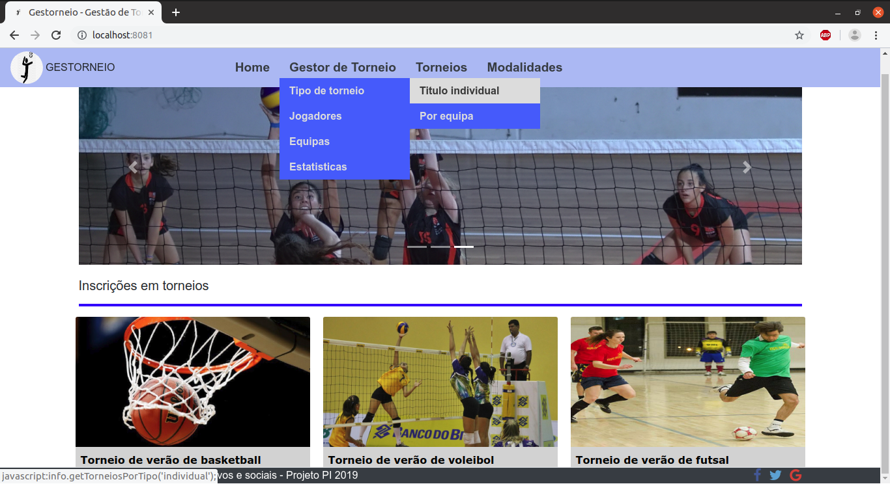
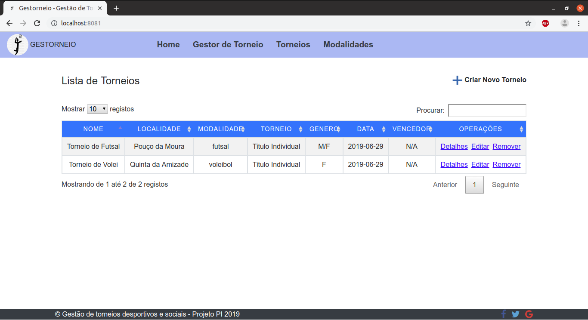
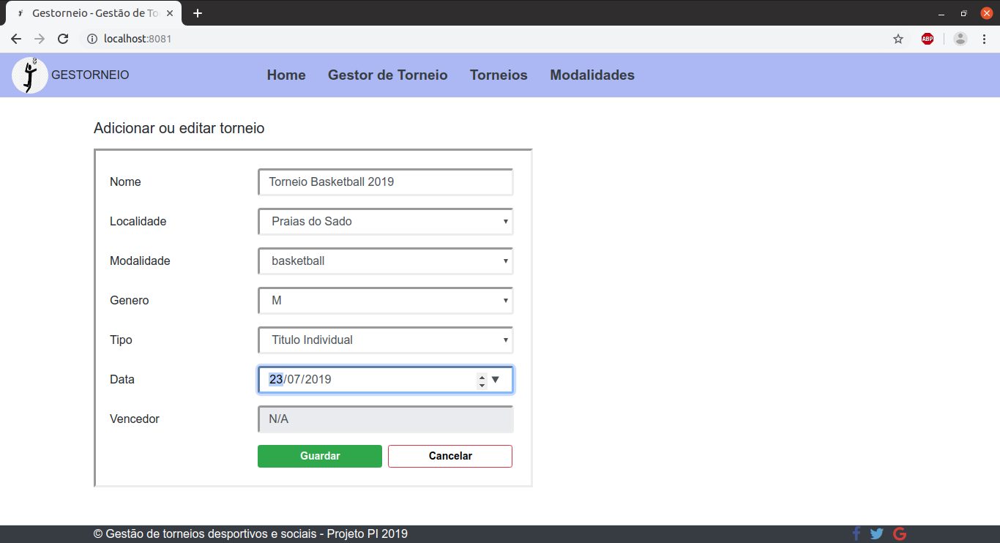
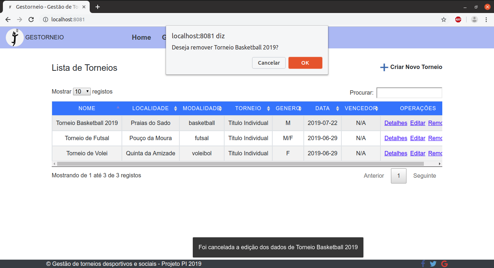
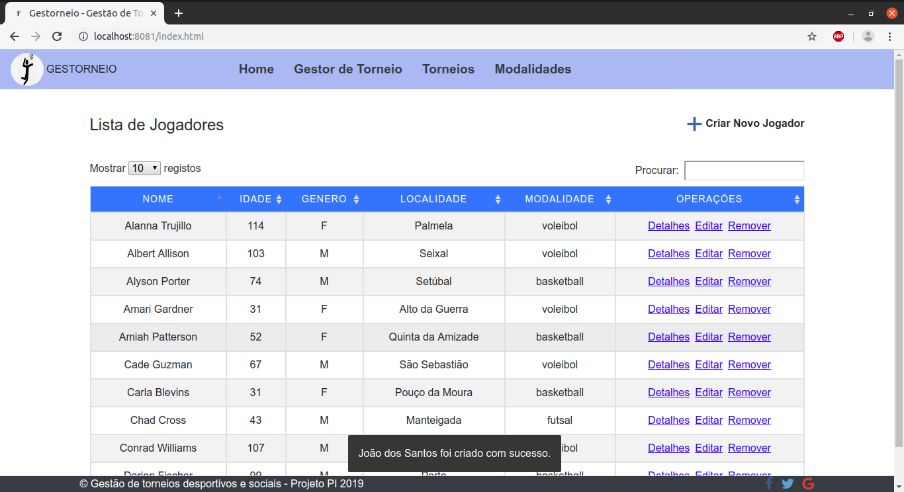
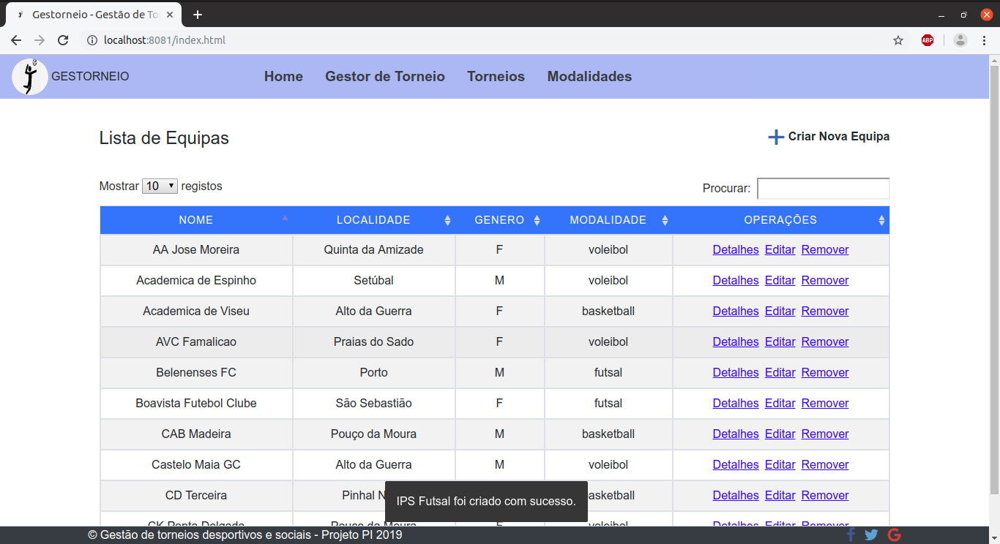
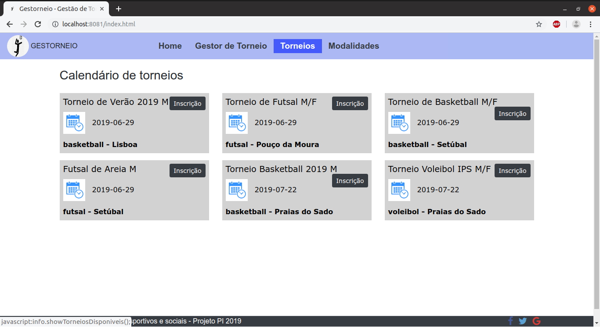
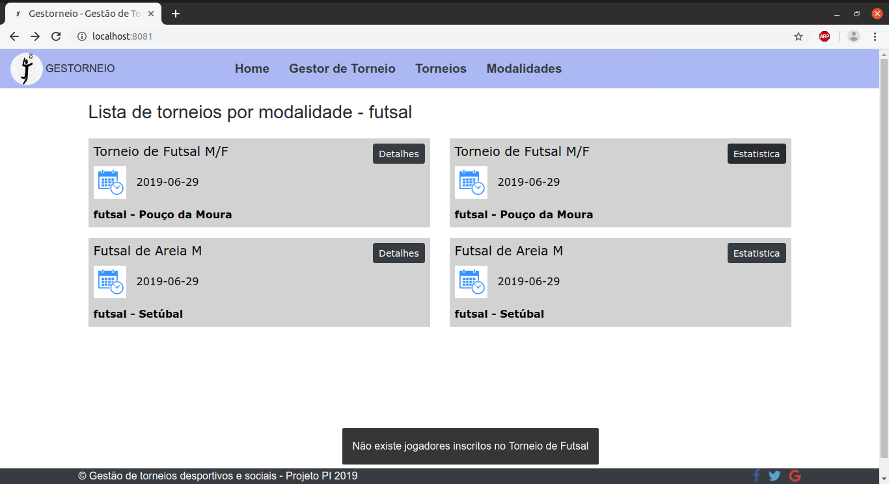
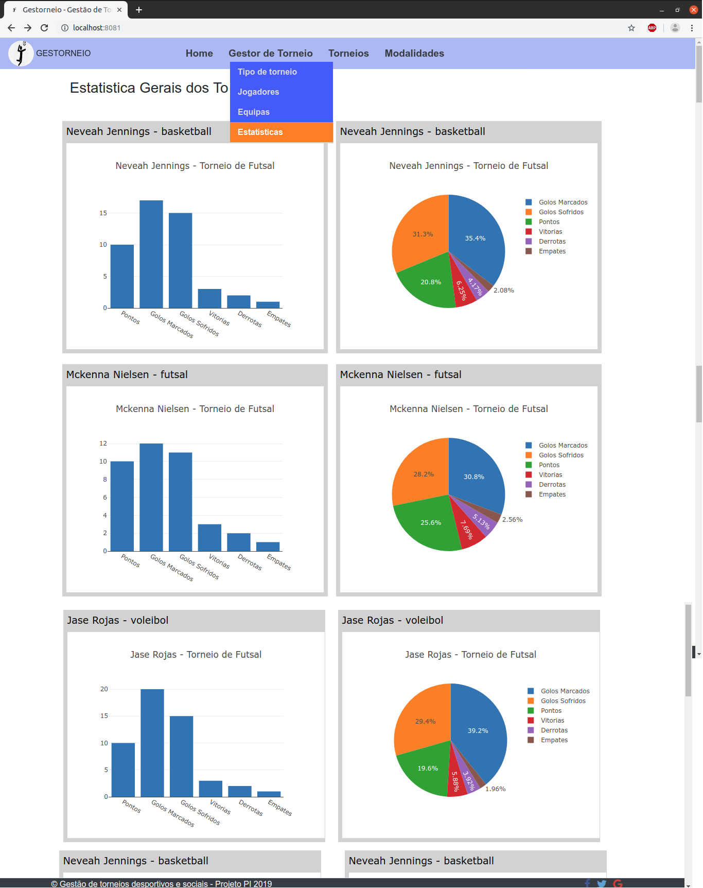
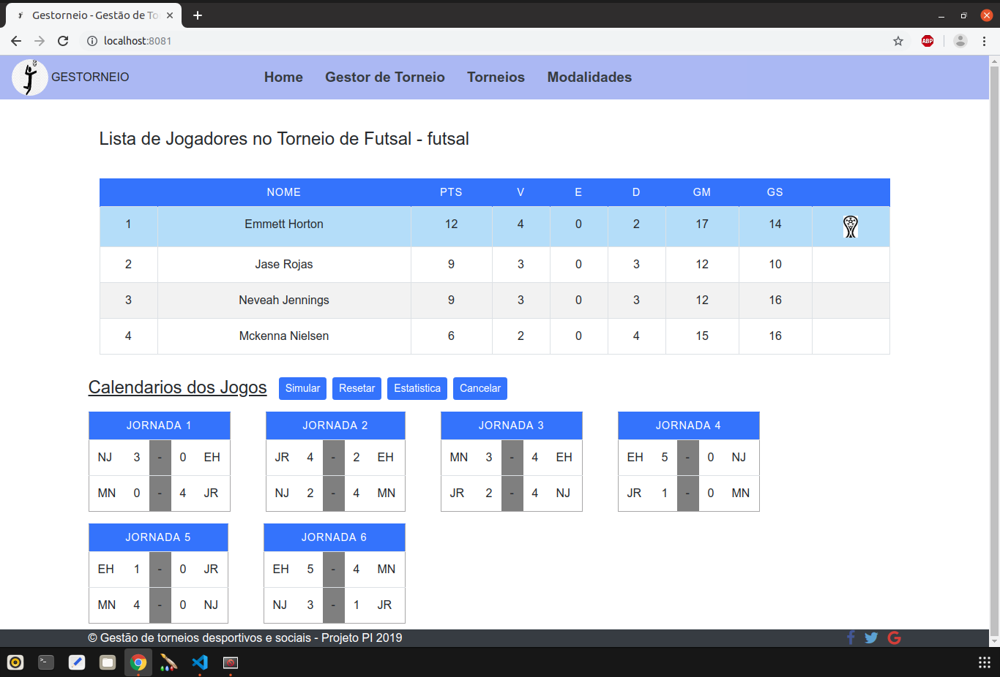
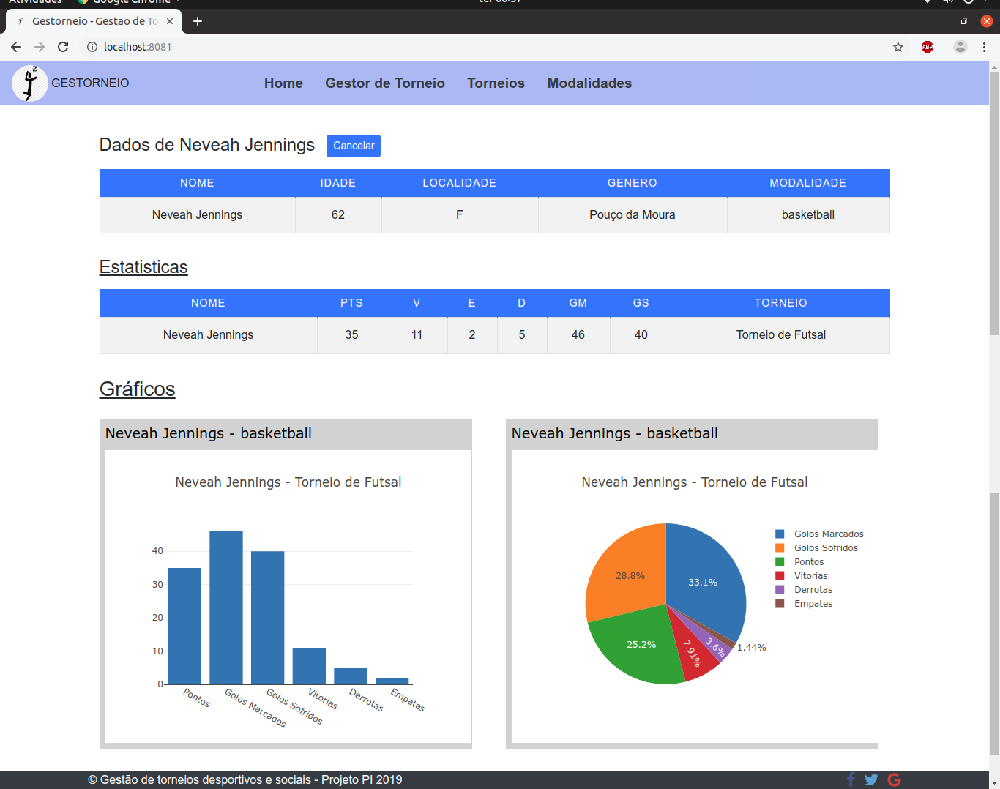
